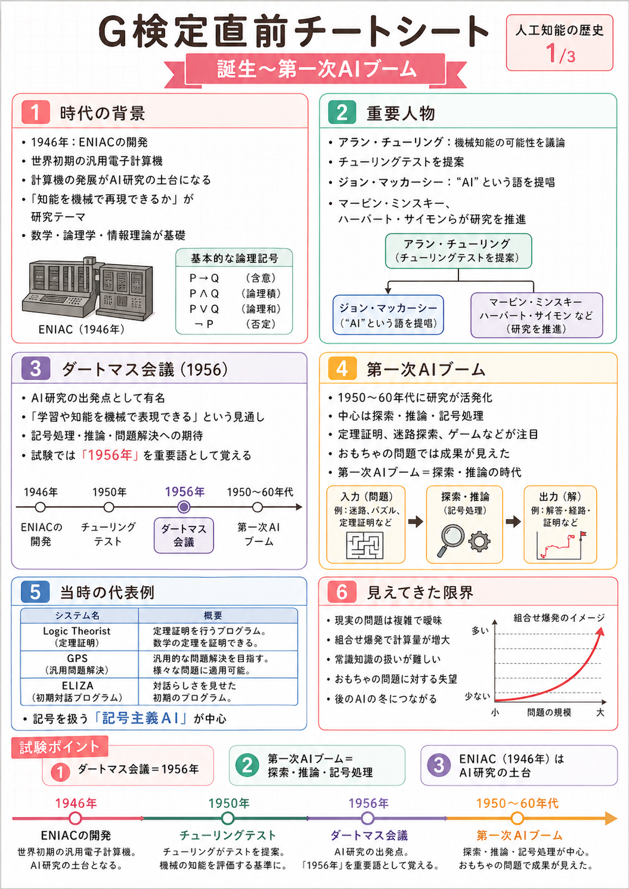
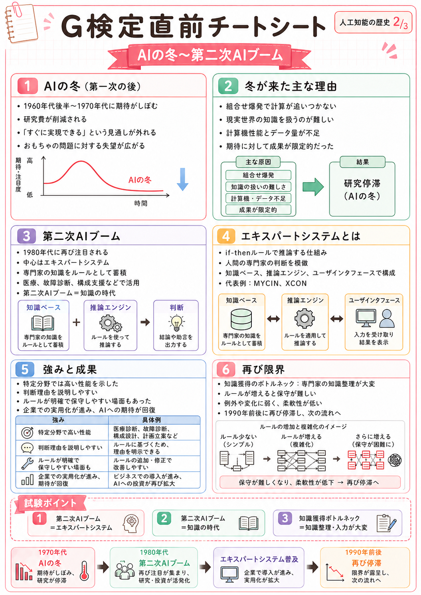
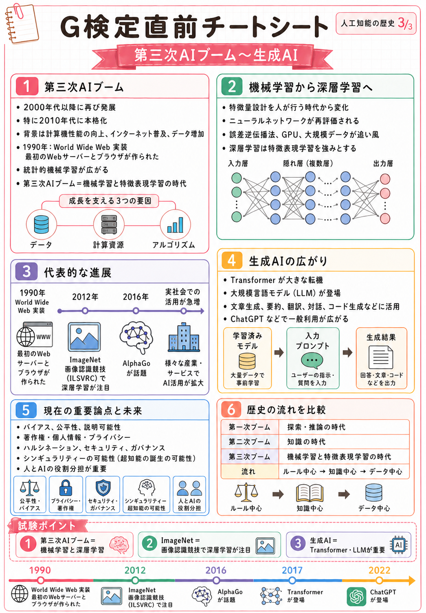
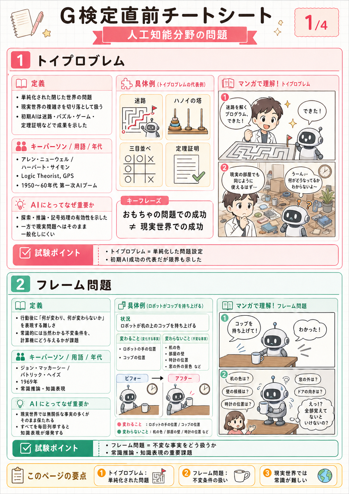
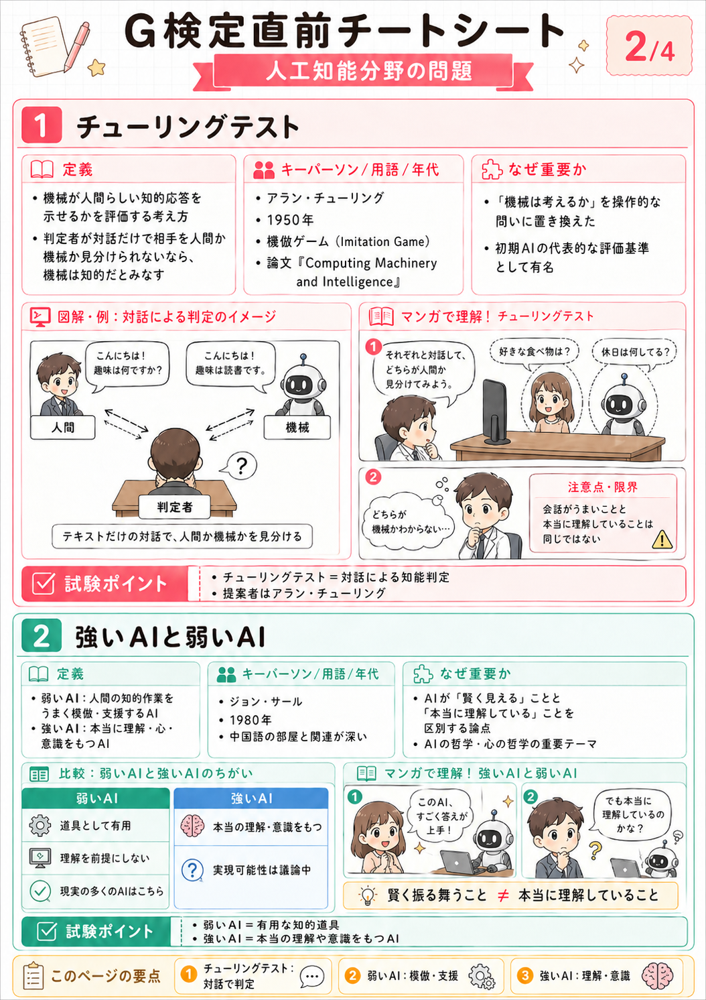
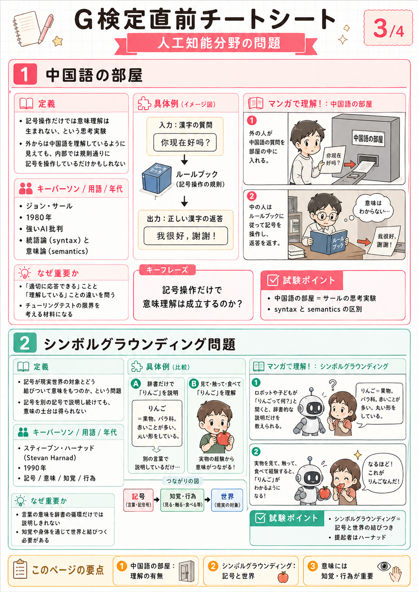
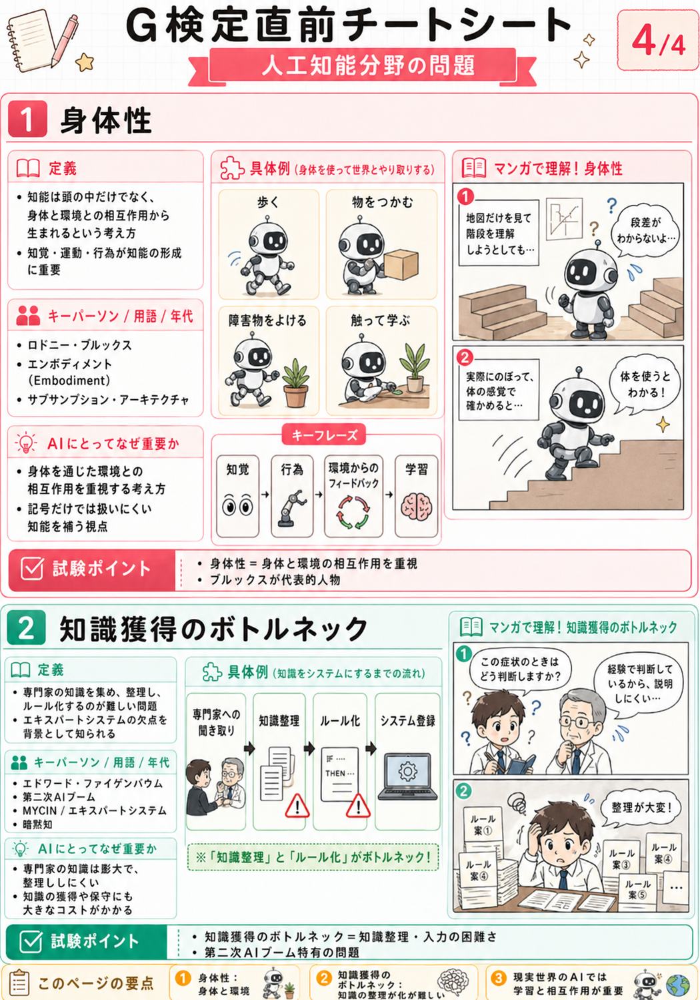

# 直前チートシート

G検定の直前確認用チートシートです。画像を開くと拡大表示できるため、タブレットで確認したり、保存してタッチペンで書き込みながら復習したりできます。

!!! note "使い方"
    まず画像で全体像をつかみ、詳しい説明は各章のテキストページで確認する。試験前は「試験ポイント」と年表を中心に見直す。

## PDF

- [全チートシートPDFを開く](../assets/sheets/pdf/g-kentei-cheatsheets.pdf)

## 人工知能の歴史

| テーマ | 画像 |
|--------|------|
| 誕生〜第一次AIブーム | [画像を開く](../assets/sheets/ai-history-1.png) / [PDF](../assets/sheets/pdf/ai-history-1.pdf) |
| AIの冬〜第二次AIブーム | [画像を開く](../assets/sheets/ai-history-2.png) / [PDF](../assets/sheets/pdf/ai-history-2.pdf) |
| 第三次AIブーム〜生成AI | [画像を開く](../assets/sheets/ai-history-3.png) / [PDF](../assets/sheets/pdf/ai-history-3.pdf) |

## 人工知能分野の問題

| テーマ | 画像 |
|--------|------|
| トイプロブレム・フレーム問題 | [画像を開く](../assets/sheets/ai-problems-1.png) / [PDF](../assets/sheets/pdf/ai-problems-1.pdf) |
| チューリングテスト・強いAIと弱いAI | [画像を開く](../assets/sheets/ai-problems-2.png) / [PDF](../assets/sheets/pdf/ai-problems-2.pdf) |
| 中国語の部屋・シンボルグラウンディング問題 | [画像を開く](../assets/sheets/ai-problems-3.png) / [PDF](../assets/sheets/pdf/ai-problems-3.pdf) |
| 身体性・知識獲得のボトルネック | [画像を開く](../assets/sheets/ai-problems-4.png) / [PDF](../assets/sheets/pdf/ai-problems-4.pdf) |

## 関連ページ

- [AI歴史](../ai/history.md)
- [人工知能分野の問題](../ai/classical_problems.md)
